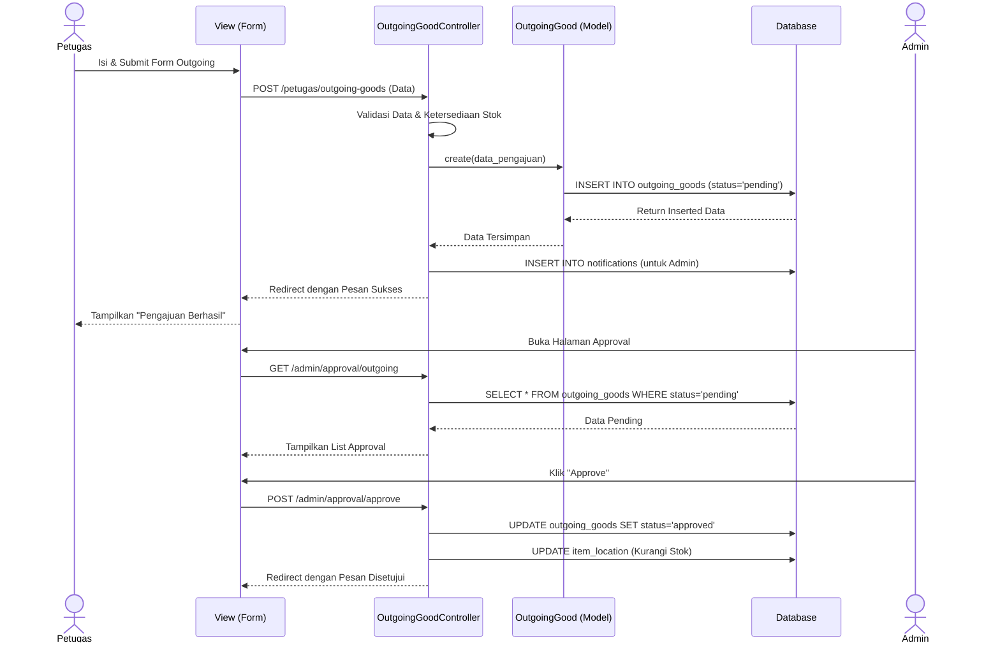
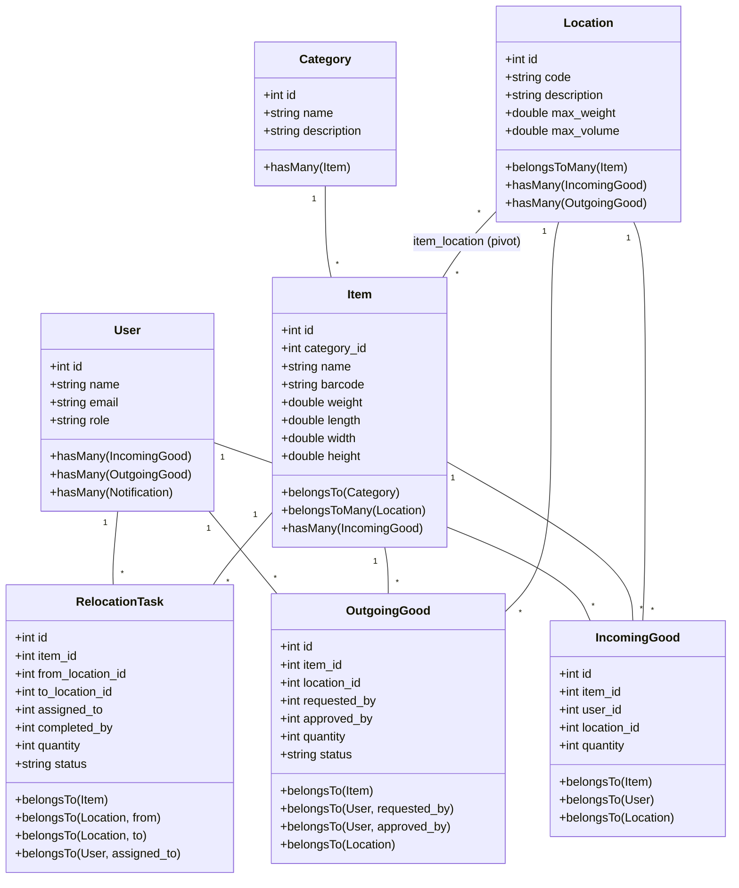
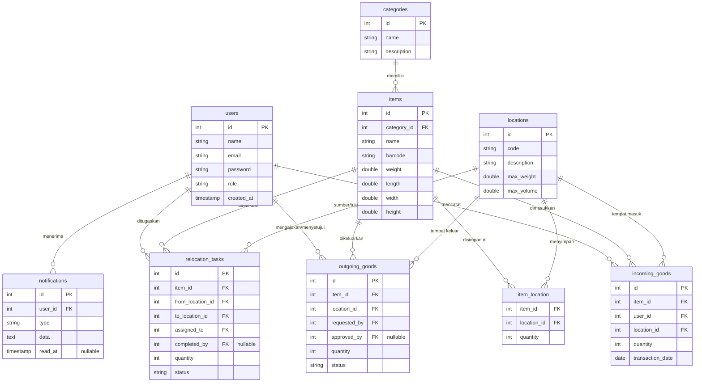

# Desain Sistem - Warehouse Management System (WMS)

Dokumen ini berisi rancangan sistem berupa Use Case Diagram, Activity Diagram, Sequence Diagram, Class Diagram, dan Entity Relationship Diagram (ERD). Diagram ini direpresentasikan menggunakan format *Mermaid* agar dapat dirender secara langsung.

---

## 1. Use Case Diagram

Diagram ini menggambarkan interaksi antara aktor pengguna dengan sistem secara keseluruhan dimana terdapat dua pihak utama yang berperan yaitu Admin yang memiliki akses penuh terhadap manajemen data dan persetujuan transaksi sedangkan Petugas lebih berfokus pada operasional teknis seperti pencatatan barang masuk barang keluar dan proses pemindahan atau relokasi barang di dalam gudang

```mermaid
usecaseDiagram
    actor Admin
    actor Petugas

    package "Warehouse Management System (WMS)" {
        usecase "Kelola Pengguna (User)" as UC1
        usecase "Kelola Kategori (Category)" as UC2
        usecase "Kelola Lokasi Gudang (Location)" as UC3
        usecase "Kelola Barang (Item)" as UC4
        usecase "Pengaturan Sistem (Setting)" as UC5
        usecase "Persetujuan Transaksi (Approval)" as UC6
        usecase "Manajemen Ruang (CBS)" as UC11
        
        usecase "Catat Barang Masuk (Incoming)" as UC7
        usecase "Catat Barang Keluar (Outgoing)" as UC8
        usecase "Tugas Relokasi (Relocation)" as UC9
        usecase "Gunakan Scanner (Barcode)" as UC10
    }

    Admin --> UC1
    Admin --> UC2
    Admin --> UC3
    Admin --> UC4
    Admin --> UC5
    Admin --> UC6
    Admin --> UC11

    Petugas --> UC7
    Petugas --> UC8
    Petugas --> UC9
    Petugas --> UC10
    Petugas --> UC11
```

Penjelasan Sintaksis Mermaid
Bagian usecaseDiagram digunakan untuk mendeklarasikan jenis diagram. Kata kunci actor dipakai untuk mendefinisikan pengguna yang berinteraksi yaitu Admin dan Petugas. Sebuah package mendefinisikan batasan sistem tempat dimana fungsi fungsi atau usecase berada. Kata kunci usecase digunakan untuk mendefinisikan fitur sistem dan as berfungsi sebagai alias untuk menyingkat penulisan nama fitur. Simbol panah menunjukkan adanya interaksi komunikasi secara langsung antara pengguna atau aktor dengan usecase tertentu

---

## 2. Activity Diagram

Pada WMS ini, terdapat tiga proses operasional utama yang dijalankan: Proses Barang Masuk, Proses Barang Keluar, dan Proses Relokasi Barang.

### A. Proses Barang Masuk (Incoming Goods)

Diagram aktivitas ini menjabarkan alur pencatatan barang yang baru tiba di gudang. Petugas memindai atau memilih barang dan sistem akan memvalidasi apakah lokasi penyimpanan memiliki sisa ruang kapasitas yang cukup sebelum stok ditambahkan.

```mermaid
activityDiagram
    start
    partition Petugas {
        :Buka Menu Barang Masuk;
        :Scan Barcode / Pilih Barang;
        :Input Kuantitas Barang;
        :Submit Data;
    }
    partition Sistem {
        :Cek Kapasitas Lokasi Tujuan;
        if (Kapasitas Cukup?) then (Ya)
            :Simpan Histori Barang Masuk;
            :Tambahkan Stok pada Lokasi;
            :Tampilkan Pesan Sukses;
        else (Tidak)
            :Tampilkan Pesan Error Kapasitas Penuh;
        endif
    }
    stop
```

### B. Proses Pengeluaran Barang (Outgoing Goods)

Diagram aktivitas ini menjabarkan secara rinci urutan proses pengeluaran barang dari gudang dimana proses dimulai ketika petugas menginputkan data pengajuan barang keluar kemudian sistem meneruskannya kepada admin untuk ditinjau dan jika disetujui maka sistem akan secara otomatis memotong stok barang yang bersangkutan.

```mermaid
activityDiagram
    start
    partition Petugas {
        :Login ke Sistem;
        :Buka Menu Barang Keluar;
        :Isi Form Pengeluaran (Pilih Barang, Lokasi, Kuantitas);
        :Submit Pengajuan Keluar;
    }
    partition Sistem {
        :Simpan Status "Pending";
        :Kirim Notifikasi ke Admin;
    }
    partition Admin {
        :Buka Notifikasi / Menu Approval;
        :Review Pengajuan Keluar;
        if (Setujui?) then (Ya)
            partition Sistem {
                :Update Status "Approved";
                :Kurangi Stok di item_location;
                :Kirim Notifikasi ke Petugas;
            }
        else (Tidak)
            partition Sistem {
                :Update Status "Rejected";
                :Kirim Notifikasi Penolakan ke Petugas;
            }
        endif
    }
    stop
```

### C. Proses Relokasi Barang (Relocation Task)

Diagram aktivitas ini menunjukkan alur kerja tugas pemindahan barang. Admin membuat tugas pemindahan barang dari satu rak ke rak lain, kemudian petugas gudang mengeksekusi tugas tersebut di lapangan.

```mermaid
activityDiagram
    start
    partition Admin {
        :Buka Menu Relokasi Barang;
        :Buat Tugas Relokasi Baru;
        :Tentukan Barang, Lokasi Asal, Tujuan, dan Petugas;
        :Submit Tugas;
    }
    partition Sistem {
        :Simpan Tugas Status "Pending";
        :Kirim Notifikasi ke Petugas;
    }
    partition Petugas {
        :Lihat Daftar Tugas Relokasi;
        :Lakukan Pemindahan Fisik;
        :Klik "Selesaikan Tugas";
    }
    partition Sistem {
        :Kurangi Stok di Lokasi Asal;
        :Cek Kapasitas Lokasi Tujuan;
        if (Overflow?) then (Ya)
            :Simpan Sisa ke Bulk Area;
        else (Tidak)
            :Tambahkan Stok ke Lokasi Tujuan;
        endif
        :Update Status Tugas "Completed";
    }
    stop
```

Penjelasan Sintaksis Mermaid
Klausa activityDiagram menandakan bahwa blok ini adalah diagram aktivitas. Blok start dan stop digunakan untuk menunjukkan titik awal dan titik akhir dari keseluruhan proses. Kata kunci partition digunakan untuk membagi aktivitas berdasarkan pihak atau aktor yang melakukannya yang dalam hal ini disebut sebagai swimlane. Simbol titik dua dan titik koma digunakan untuk mendeskripsikan satu langkah kegiatan. Blok percabangan if then else dan endif dipakai untuk merepresentasikan pengambilan keputusan atau kondisi tertentu yang menentukan alur proses selanjutnya berdasarkan aksi sebelumnya

---

## 3. Sequence Diagram

Sequence diagram ini mengilustrasikan urutan komunikasi antar entitas di dalam sistem pada saat proses pengajuan barang keluar mulai dari interaksi petugas pada antarmuka sistem pemrosesan data oleh controller penyimpanan transaksi di database hingga dilanjutkan dengan proses persetujuan oleh admin



Penjelasan Sintaksis Mermaid
Deklarasi sequenceDiagram menentukan jenis diagram sebagai diagram urutan kejadian. Terdapat actor yang mewakili pengguna sistem serta participant yang mewakili komponen komponen sistem seperti tampilan pengendali dan model basis data. Penggunaan as adalah untuk memberikan singkatan yang mempermudah penyebutan entitas di baris selanjutnya. Panah dengan garis lurus dan panah penuh merepresentasikan pemanggilan proses atau pengiriman pesan yang meminta aksi dari satu objek ke objek lain sedangkan panah garis putus putus dengan panah terbuka menunjukkan pesan balasan atau respons pengembalian nilai

---

## 4. Class Diagram

Class diagram ini memperlihatkan struktur model data yang ada di dalam sistem yang mencakup atribut atau properti pada masing masing kelas serta bagaimana bentuk hubungan dan kardinalitas yang terjadi antar bagian seperti pengguna barang kategori dan lokasi penyimpanan



Penjelasan Sintaksis Mermaid
Kata kunci classDiagram mengawali pembuatan diagram kelas. Setiap kata kunci class diikuti oleh nama entitas untuk mendefinisikan sebuah tabel atau model di dalam sistem. Atribut dan fungsi operasi dari masing masing kelas dituliskan di dalam tanda kurung kurawal. Simbol plus menunjukkan bahwa atribut atau fungsi tersebut bersifat publik yang dapat diakses dari luar kelas. Penulisan relasi menggunakan garis lurus antar kelas ditambahkan dengan tanda kutip untuk memperjelas kardinalitas seperti angka satu untuk tunggal dan tanda bintang untuk jumlah banyak atau banyak ke banyak

---

## 5. Entity Relationship Diagram (ERD)

ERD ini merepresentasikan rancangan fisik basis data yang mendasari aplikasi yang secara jelas menunjukkan entitas tabel yang terlibat letak kunci utama serta hubungan kunci tamu untuk merelasikan pencatatan barang pengguna transaksi dan lokasi fisik secara terintegrasi



Penjelasan Sintaksis Mermaid
Deklarasi erDiagram mendefinisikan awal mula entitas relasi diagram. Nama entitas diikuti tanda kurung kurawal menyimpan daftar kolom yang dimiliki tabel tersebut. Tipe data ditulis lebih dulu diikuti nama kolom. Label PK berarti Primary Key sebagai kunci utama tabel sementara FK bermakna Foreign Key sebagai kunci referensi ke tabel lain. Teks nullable di dalam kutip ganda menandakan bahwa data tersebut boleh bernilai kosong. Garis dengan ujung ganda dan ujung menyerupai cakar burung melambangkan hubungan satu ke banyak antar entitas yang ditambahkan dengan label teks untuk menjelaskan nama kegiatan dari relasi tersebut

---

## 6. Tabel Pengujian Sistem (Testing Tables)

Berikut adalah tabel pengujian fungsionalitas sistem (Black-box Testing) berdasarkan peran masing-masing aktor.

### A. Tabel Pengujian Admin

Tabel ini memuat skenario pengujian fungsionalitas yang dapat diakses dan dikelola oleh Admin.

| No | Aksi | Menu | Pengujian yang diharapkan | Hasil |
|----|------|------|---------------------------|-------|
| 1  | Memasukkan email dan password admin | Login | Sistem membaca data karyawan tersebut sebagai admin dengan menampilkan fitur menu dashboard | Sesuai yang diharapkan |
| 2  | Melihat total data barang, kategori, lokasi, kapasitas ruang gudang, serta grafik statistik barang masuk/keluar | Dashboard | Menampilkan total data dan visualisasi statistik gudang secara real-time | Sesuai yang diharapkan |
| 3  | Menambahkan data pengguna baru (Admin/Petugas) | Kelola Pengguna | Sistem menambahkan data pengguna baru dan menyimpannya ke tabel `users` | Sesuai yang diharapkan |
| 4  | Mengubah data pengguna dan mengganti kata sandi | Kelola Pengguna | Sistem mengupdate data pengguna bersangkutan di basis data | Sesuai yang diharapkan |
| 5  | Menambahkan data kategori barang | Kelola Kategori | Kategori baru berhasil ditambahkan dan disimpan ke tabel `categories` | Sesuai yang diharapkan |
| 6  | Menambahkan lokasi gudang baru beserta kapasitas maksimal berat (`max_weight`) dan volume (`max_volume`) | Kelola Lokasi | Sistem menyimpan lokasi rak baru dengan kapasitas ruang yang terukur | Sesuai yang diharapkan |
| 7  | Menambahkan data barang baru lengkap dengan informasi barcode dan dimensi barang | Kelola Barang | Sistem menyimpan barang baru ke tabel `items` dan mengaitkannya dengan kategori | Sesuai yang diharapkan |
| 8  | Menyetujui (Approve) pengajuan barang keluar dari petugas | Approval Transaksi | Status pengajuan berubah menjadi `approved`, stok di lokasi terkait berkurang, dan notifikasi terkirim | Sesuai yang diharapkan |
| 9  | Menolak (Reject) pengajuan barang keluar dari petugas | Approval Transaksi | Status pengajuan berubah menjadi `rejected` tanpa memotong stok barang | Sesuai yang diharapkan |
| 10 | Membuat tugas relokasi barang dan menugaskannya kepada petugas tertentu | Tugas Relokasi | Sistem menyimpan tugas relokasi dengan status `pending` di tabel `relocation_tasks` | Sesuai yang diharapkan |

---

### B. Tabel Pengujian Petugas

Tabel ini memuat skenario pengujian fungsionalitas operasional gudang yang dilakukan oleh Petugas.

| No | Aksi | Menu | Pengujian yang diharapkan | Hasil |
|----|------|------|---------------------------|-------|
| 1  | Memasukkan email dan password petugas | Login | Sistem membaca data karyawan tersebut sebagai petugas gudang dan menampilkan menu operasional gudang | Sesuai yang diharapkan |
| 2  | Menginput barang masuk pada lokasi rak dengan kapasitas ruang (berat & volume) yang cukup | Barang Masuk | Stok barang di lokasi (`item_location`) bertambah dan riwayat barang masuk tersimpan | Sesuai yang diharapkan |
| 3  | Menginput barang masuk pada lokasi rak yang sudah penuh atau melebihi batas kapasitas maksimal | Barang Masuk | Sistem menolak input barang dan menampilkan peringatan bahwa kapasitas lokasi tidak cukup | Sesuai yang diharapkan |
| 4  | Mengisi dan mengirim form pengajuan pengeluaran barang | Barang Keluar | Transaksi barang keluar disimpan dengan status `pending` dan terkirim ke halaman persetujuan Admin | Sesuai yang diharapkan |
| 5  | Melihat dan menyelesaikan tugas relokasi barang yang ditugaskan | Tugas Relokasi | Stok berpindah dari lokasi asal ke lokasi tujuan dan status tugas terupdate menjadi `completed` | Sesuai yang diharapkan |
| 6  | Menyelesaikan tugas relokasi barang yang kapasitas lokasi tujuannya tidak muat | Tugas Relokasi | Sistem mengalokasikan stok sesuai batas maksimum lokasi tujuan dan mengarahkan sisanya ke Bulk Area (Overflow) | Sesuai yang diharapkan |
| 7  | Memindai barcode barang menggunakan scanner kamera/alat pemindai | Barcode Scanner | Sistem mencocokkan kode barcode secara otomatis dan menampilkan detail informasi barang pada form terkait | Sesuai yang diharapkan |
| 8  | Menerima pemberitahuan persetujuan transaksi atau tugas relokasi baru | Notifikasi | Notifikasi muncul di header aplikasi dan status berubah menjadi dibaca setelah diklik | Sesuai yang diharapkan |

